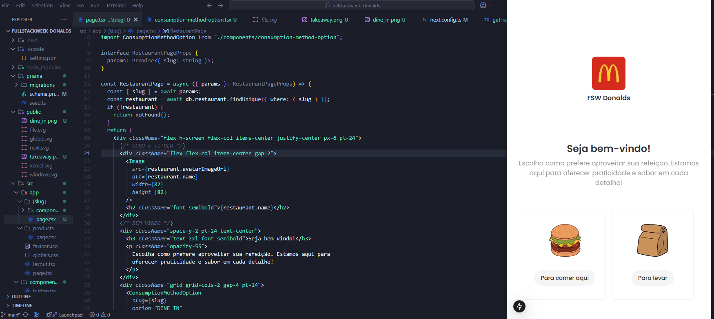
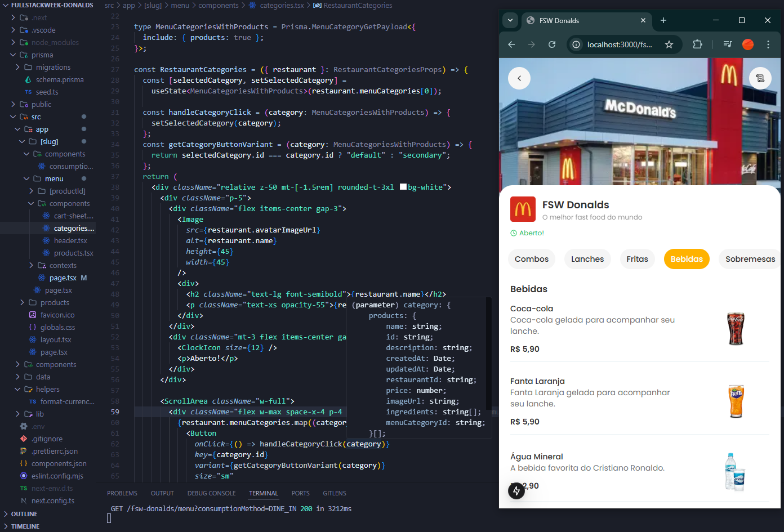
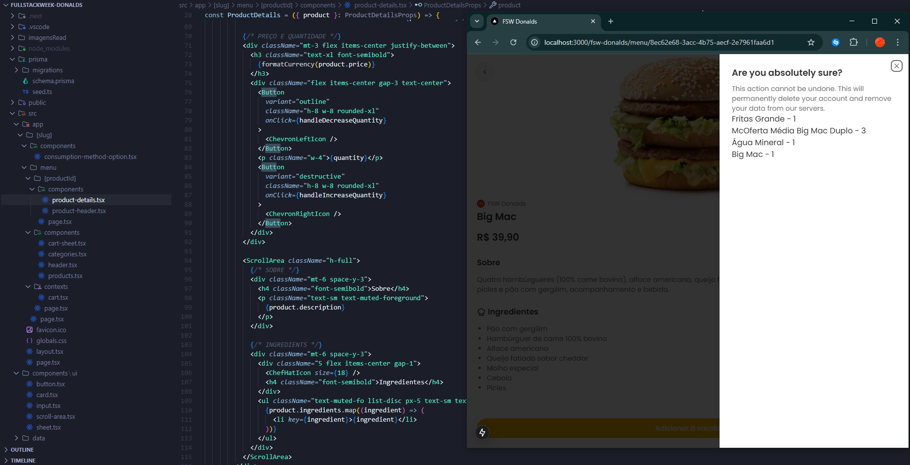
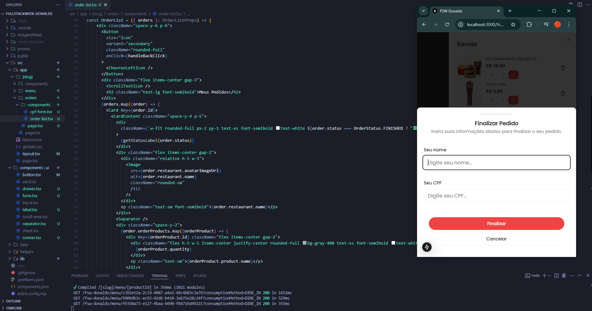

# Sistema de Autoatendimento para Restaurantes

Este projeto é um sistema de autoatendimento para restaurantes, inspirado nos tótens do McDonald's e Burger King, além de versões mobile para facilitar pedidos. Utilizando tecnologias modernas, buscamos recriar uma experiência intuitiva e eficiente para os clientes realizarem pedidos de forma independente.

## Tecnologias Utilizadas

- **Next.js** - Framework React para desenvolvimento frontend
- **TypeScript** - Tipagem estática para maior segurança no código
- **Figma** - Protótipos e design do sistema
- **Prisma** - ORM para gerenciamento do banco de dados
- **NeonDB** - Banco de dados PostgreSQL em nuvem
- **PostgreSQL** - Banco de dados relacional para armazenamento seguro
- **Tailwind CSS** - Estilização moderna e responsiva

## Visão Geral do Sistema

### Página Inicial
  
Tela inicial do restaurante, onde o usuário pode iniciar o processo de pedido.

### Catálogo de Produtos
  
Listagem dos itens disponíveis no restaurante, categorizados para facilitar a navegação.

### Itens Selecionados
  
Tela que exibe os itens escolhidos pelo cliente antes de finalizar o pedido.

### Carrinho do Cliente
  
Resumo do pedido, onde o cliente pode revisar e concluir a compra.

## Instalação e Uso


   ```
1. Instale as dependências:
   ```sh
   npm install
   ```
2. Configure o banco de dados no arquivo `.env`.
3. Execute o projeto:
   ```sh
   npm run dev
   ```
4. Acesse no navegador: `http://localhost:3000`
